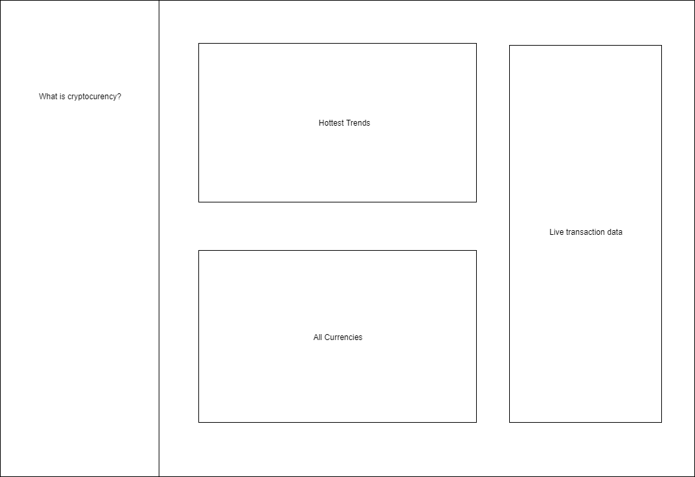

## Cryptodata - A visual guide to cryptocurrency

### Background and Overview

Cryptodata is a data visualization project that will introduce users to the world of cryptocurrency with easy to understand charts displaying the latest trends in cryptocurrency.

### Functionality and MVP

In Cryptodata, users will be able to
- [x] learn the basics of how cryptocurrency works
- [x] choose cryptocoins to follow
- [x] see market trends of various cryptocoins
- [x] toggle between represntation of trends from the past hour, day, month, year, and all time
- [ ] see live websocket data of transactions

### Wireframes
This app will use a single screen split up into a sidebar with a brief overview on cryptocurrencies and a main section with several charts showing market trends for the different cryptocoins. Users will be able to toggle the display to show data on different crypto coins, including all the live transactions for that currency.

### Architecture and Technologies
This project will be implemented with the following technologies:
- vanilla `javascript` for overall structure
- `highcharts.js` for live visualization of data
- a `Node` backend for processing API requests
- `cryptocompare API` for market data
- `blockchain.info API` for live transaction data

### Implementation Timeline
#### Over the weekend
- [x] research cryptocurrency
- [x] research javascript libraries for visualizing data
- [x] research crypto api's
#### Day 1
- [x] setup javascript project and node backend
- [x] process api requests with backend
#### Day 2
- [x] implement highcharts
- [x] create basic graphs
#### Day 3
- [x] render api data through `highcharts.js`
#### Day 4
- [x] write info section
- [x] final touches to structure and styling
